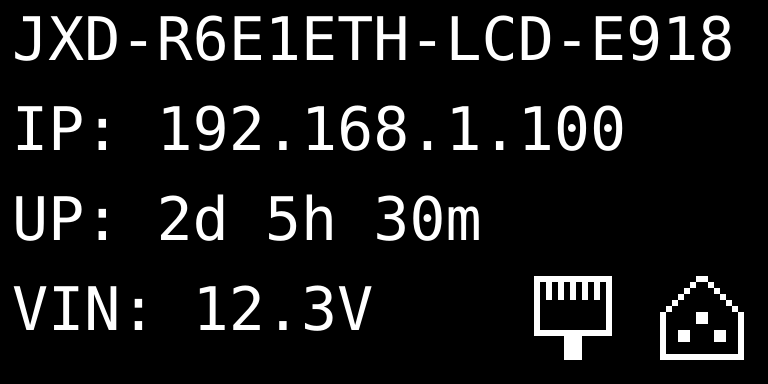
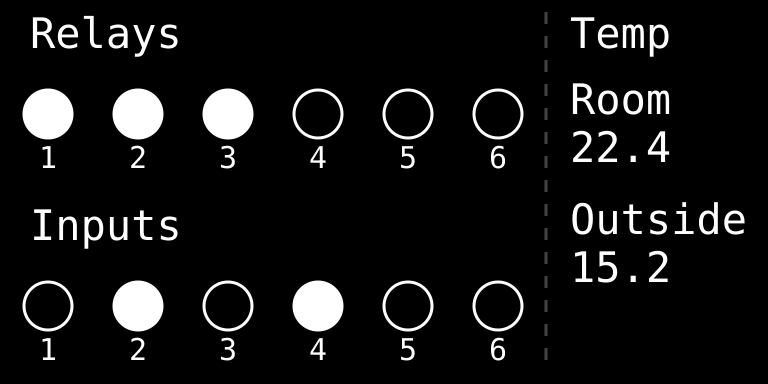
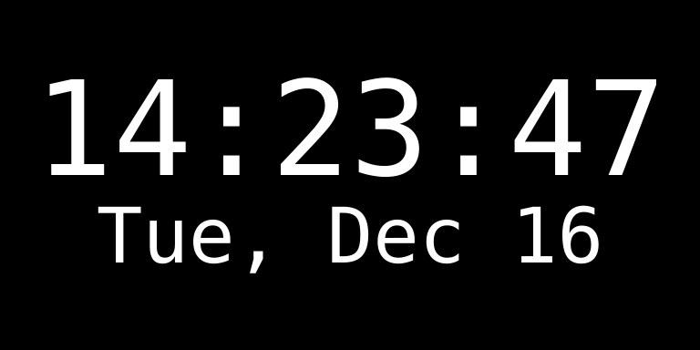
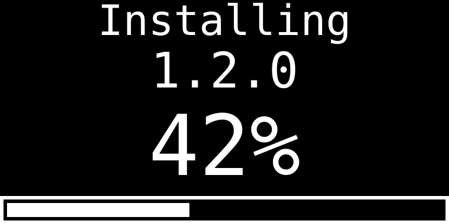

# ESPHome Device Configurations made by JetHome


This repository contains ESPHome configurations for various automation devices. These are **open-source firmware configurations** that you can customize and build yourself.

## Supported Devices

### JXD-R6-E1ETH-LCD

JetHome DIN-rail automation controller with display. For a proprietary firmware version with additional features and support, visit [JetHome official website](https://jethome.com/).

**Configuration file**: `devices/JXD/jxd-r6-e1eth-lcd.yaml`

## JXD-R6-E1ETH-LCD Features

The JXD-R6-E1ETH-LCD is a powerful DIN-rail automation controller with the following capabilities:

### Hardware

- **ESP32** microcontroller with 16MB flash and PSRAM
- **6 Relay outputs** via PCA9554 I/O expander
- **6 Digital inputs** via PCA9554 I/O expander
- **OLED Display**: SSD1306/SH1106 128x64 pixels with interactive menu
- **RTC**: PCF8563 hardware real-time clock with battery backup
- **Temperature monitoring**: Onboard TMP102 sensor + up to sixteen Dallas DS18B20 over a DS2484 I²C-to-1-Wire bridge
- **Connectivity**: LAN8720 Ethernet and WiFi (ESP32 built-in)
- **Voltage monitoring**: Input voltage measurement
- **RS485/Modbus**: 2x UART interfaces for Modbus RTU communication and for add-on and custom expansion modules

### Software Features

- **RTC Time Synchronization**: Hardware RTC with battery backup, synced from Home Assistant or NTP, timezone included
- **Modbus RTU Server**: Acts as Modbus slave, mapping relays to coils, digital inputs to discrete inputs and temperatures to holding registers
- **Home Assistant Integration**: Native ESPHome API with automatic entity discovery and OTA updates
- **Web dashboard** at `http://<device>/`: overview, live entities and their settings, automations, the device log, the file manager and the device settings, served from the firmware ([details](components/web_device_dashboard/README.md))
- **Firmware updates**: a firmware released from this repository polls fw.jethome.com for the
  latest build of its channel (`release` or `nightly`) and installs it on request; a config
  imported into the ESPHome Builder is yours to update ([details](doc/RELEASE.md#updates-on-the-device))
- **Display Control**: Interactive OLED menu with status, time, relay control, input monitoring, and settings
- **Dallas Temperature Sensors**: a sensor per DS18B20 found at boot, numbered once and kept across reboots ([details](doc/ONEWIRE_WORKFLOW.md))
- **User Storage**: a 4 MB LittleFS partition mounted at `/littlefs`, kept across OTA updates, served over HTTP as a JSON file API under `/files` ([details](components/web_file_browser/README.md))
- **Runtime Automations**: rules stored on that partition as JSON, loaded at boot and editable without a recompile, over HTTP under `/automation-editor/api` ([details](doc/AUTOMATIONS.md))
- **Per-entity settings**: each relay's inversion, start mode and the input bound to it, and each
  input's inversion, set from the display menu and kept on that partition
  ([details](doc/ENTITY_SETTINGS.md))
- **Password-protected web server**: `admin` / `admin` out of the factory, changed from the
  dashboard and kept across reboots ([details](components/web_auth/README.md))

## Repository Layout

```
devices/JXD/
  jxd-r6-e1eth-lcd.yaml     # device config
  packages/                 # boards, features, display, qemu
assets/
  fonts/  res/
components/                 # external components
tests/                      # Google Test suites, one per component under tests/components/
```

Each device config sets `assets: ../../assets`, `components: ../../components`,
`boards: packages/boards`, `features: packages/features` and `display: packages/display`, all
relative to the device config: it lists its packages as `!include ${features}/…`, and the
packages reference fonts and icons as `${assets}/fonts/…` and external components as
`source: ${components}`.

The device configs are thin: they set substitutions and list the packages that make up
the device. Those packages live under the family's `packages/`, split by role:

| Directory            | Contents |
| -------------------- | -------- |
| `packages/boards/`   | Platform and the chips sitting on each board — `jxd-cpu-e1eth.yaml` (ESP32, api/ota/logger/web_server, TMP102, LED, the identity EEPROM) and `jxd-d6-r6-rev1.2.yaml` (PCA9554 expander, 6 relays, 6 inputs, DS2484 1-Wire bridge) |
| `packages/features/` | SoC buses (`i2c.yaml`, `uarts.yaml`) and functionality — `storage`, `entity-settings`, `temperature`, `rtc-time`, `vin-measure`, `modbus-server`, `display-off`, `network`, `web-auth`, `web-device-dashboard`, `web-file-browser`, `automations`, `automation-editor`, `firmware-update` |
| `packages/display/`  | Display, pages, menu and buttons — `display.yaml`, `menu.yaml`, `buttons.yaml`, `menu-items-network.yaml`, `menu-serial.yaml`, `menu-firmware.yaml`, `firmware-page.yaml` |
| `packages/qemu/`     | Overlays that `scripts/qemu.sh` layers over the real config to run it in the emulator — never part of a firmware build |

Shared code and tooling stay at the repository root:

| Directory  | Contents |
| ---------- | -------- |
| `components/` | External components: `dallas_scan` (the DS18B20 sensors, created at boot), `automations` (the runtime rule engine), `littlefs_storage` (the LittleFS partition of `packages/features/storage.yaml`) with its `filesystem_storage_abstract` base, `web_file_browser` (the file API over that partition), `web_automation_editor` (the rule API of `automations`), `web_device_dashboard` (the web UI at `/` and its device API), `web_auth` (the web server's credentials, changeable at runtime), `web_origin_guard` (the cross-origin refusal every handler on that server answers with), `loop_job` (what a web handler hands the loop task so it does not edit its state from the server's), `jethome_board_info` (the board identity from the CPU board's EEPROM) over `i2c_eeprom`, `virtual_display` (the emulator's front panel), `entity_config` (the per-entity settings) with the `config_base` / `config_json` it is built on, `bindings` (an input driving a relay), `jethome_update` (the firmware update entity) over the `jethome_manifest` parser of the firmware server's answer, and `display_menu_base` with `graphical_display_menu` (upstream's, with the menu options `packages/display/menu.yaml` needs) |
| `scripts/` | Generators and tools: `build-dist.py`, `build-icons.py`, `firmware-matrix.py`, `modbus_probe.py`, `device-files.py` (the `web_file_browser` API from a terminal), `qemu.sh` (the emulator), `setup.sh` / `setup.bat` |
| `dist/`    | Generated self-contained configs the ESPHome Builder imports |
| `doc/`     | Guides, plus the README's UI mockups in `doc/images/` |
| `tests/`   | `tests/components/<name>/` is that component's Google Test suite, built for the ESPHome `host` platform and run by `python tests/run.py`; `tests/harness/` is what every suite shares |

The BDF display fonts in `assets/fonts/` come from [IT-Studio-Rech/bdf-fonts](https://github.com/IT-Studio-Rech/bdf-fonts).

The firmwares this repository builds are listed in `firmwares.yaml` — the single
source of truth for CI and for the release pipeline, with a per-firmware flag
for publishing to [fw.jethome.com](https://fw.jethome.com). See the
[Release Workflow](doc/RELEASE.md). A weekly check compiles the firmwares
against new upstream ESPHome releases and opens an issue with the results.

### Generated icons (`assets/res/`)

The main page's status icons. Each one is a 16x16 pixel map in `scripts/build-icons.py`
and a set of filled rects in the SVG, so nothing is edited by hand here either:

```bash
python scripts/build-icons.py           # regenerate assets/res/
python scripts/build-icons.py --check   # fail if stale (pre-commit and CI run this)
```

### Generated configs (`dist/`)

`dist/` is what the ESPHome Builder add-on imports; build and flash locally from the
device configs under `devices/`. Nothing here is edited by hand — regenerate and
commit it after changing anything a device config pulls in:

```bash
python scripts/build-dist.py           # regenerate
python scripts/build-dist.py --check   # fail if stale (pre-commit and CI run this)
```

## Quick Start

### Requirements

- **Python 3.12, 3.13 or 3.14** (ESPHome 2026.8.2 requires `>=3.12,<3.15`)
- **ESPHome 2026.8.2** (pinned version for compatibility)
- USB cable or serial adapter for initial flashing
- Network connection for OTA updates

### Installation

1. **Clone this repository**:

   ```bash
   git clone <repository-url>
   cd esphome-device-configs
   ```

2. **Set up the Python environment.** Linux/macOS:

   ```bash
   ./scripts/setup.sh
   source .venv/bin/activate
   ```

   Windows:

   ```cmd
   scripts\setup.bat
   .venv\Scripts\activate
   ```

### Network

The firmware drives both the LAN8720 Ethernet controller and the ESP32's WiFi. The
link is picked by **Settings → Network** or the `Network mode` entity:

- `Ethernet` (default) and `WiFi` run one link and keep the other off; the change
  applies at once and survives reboots
- `Auto` keeps both up; Ethernet carries the traffic while its cable is in, WiFi takes
  over when it is not

The firmware ships without WiFi credentials. Once WiFi is switched on it raises a
fallback access point, named after the device with a password derived from its MAC,
and is provisioned through the captive portal, see [WiFi Setup](doc/WIFI_SETUP.md).

### Timezone

The device takes its timezone from Home Assistant on connect and keeps it across
reboots. Until it is paired it runs on the zone compiled into the firmware, `UTC`
by default — set that for a device that runs standalone:

```bash
esphome -s timezone Europe/Berlin run devices/JXD/jxd-r6-e1eth-lcd.yaml
```

or per device in the device config:

```yaml
substitutions:
  timezone: Europe/Berlin
```

Both IANA names (`Europe/Berlin`) and POSIX TZ strings (`CET-1CEST,M3.5.0,M10.5.0/3`)
are accepted. POSIX strings per zone: [posix_tz_db](https://github.com/nayarsystems/posix_tz_db/blob/master/zones.csv).

### First Flash

For the first flash, connect via USB:

```bash
esphome run devices/JXD/jxd-r6-e1eth-lcd.yaml
```

Subsequent updates can be done over-the-air (OTA). A change to the partition table (for
example, the size of the storage partition) needs a USB flash: OTA keeps the table it finds.

```bash
esphome run devices/JXD/jxd-r6-e1eth-lcd.yaml --device <IP_ADDRESS>
```

## Display UI Overview

Five pages plus a menu. The main page is what you get at boot and after HOME; everything
else is one button away from it, except the firmware install page, which the device puts up
on its own.

### Main Page



Shows device name, IP address, uptime and input voltage. Two icons in the bottom-right
corner report the link (Ethernet or WiFi, whichever carries the traffic) and the Home
Assistant API connection; a crossed-out icon means that connection is down. While the
fallback access point is up and no link carries traffic, the WiFi icon is shown and the
address is the access point's.

**Getting here**: HOME from anywhere, or BACK from another page.

### Status Page



Relay states, digital input states and temperature readings at a glance, and it switches
the relays: LEFT and RIGHT move the selection along the relay row — the selected number is
drawn inverted on the device — and CENTER toggles that relay. UP and DOWN scroll the
temperature column.

**Getting here**: LEFT from the main page.

### Time Page



Current date and time from the hardware RTC.

**Getting here**: RIGHT from the main page.

### Firmware Install Page



Up while a firmware image is being written, whatever asked for it — the menu, Home Assistant
or the dashboard: the version being installed, how far it has got and a progress bar. The
screen does not blank while an install runs, and the device reboots into the new firmware as
soon as the image is in. An install that fails says so instead and leaves the running firmware
untouched; any button then takes the page away, and it leaves on its own after half a minute.

**Getting here**: no button leads here; an install starting puts it up.

### Menu


- **Relays** - a submenu per relay: toggle it, and set its inversion, start mode and bound input
- **Inputs** - a submenu per input: live state and inversion
- **Temperatures** - temperature sensor readings; a DS18B20 row opens its slot: the ROM address and a forget command
- **Info** - network information (Ethernet and WiFi IP and MAC addresses, access point password), then the serial number from the CPU board's EEPROM (`--` when it holds none)
- **Settings** - display auto-off timer, Modbus settings, firmware updates (the running and the offered version, the release channel, a check and an install), temperature slots, network mode, WiFi credential reset, reboot; a factory reset clears the stored preferences (WiFi credentials, settings, the temperature slot table) and formats the user partition, taking the automation rules and uploaded files with it

**Getting here**: CENTER from the main page.

### Blank Screen

The display blanks after the inactivity timeout (**Settings → Display off**: 5, 10 or 15
minutes, or never). Any button wakes it — LEFT lands on the status page, RIGHT on the time
page, anything else on the main page.

**Getting here**: BACK from the main page, or wait out the timer.

### Buttons

| Button      | Effect                                                                                    |
| ----------- | ----------------------------------------------------------------------------------------- |
| `HOME`      | Main page, from anywhere                                                                  |
| `BACK`      | Main page; from the main page blanks the screen; in the menu goes up one level, then exits |
| `LEFT`      | Main page → status page; on the status page selects the previous relay; adjusts menu values |
| `RIGHT`     | Main page → time page; on the status page selects the next relay; adjusts menu values      |
| `CENTER`    | Main page → menu; on the status page toggles the selected relay; in the menu enters        |
| `UP` `DOWN` | Move through the menu; on the status page scroll the temperatures                          |

## Documentation

- **[Entity Settings](doc/ENTITY_SETTINGS.md)**: What a relay and an input remember across reboots, and where it is kept
- **[Runtime Automations](doc/AUTOMATIONS.md)**: Rules stored on the device, what they can do and how to test them
- **[OneWire Temperature Sensors](doc/ONEWIRE_WORKFLOW.md)**: How DS18B20 sensors get their slots, and how to reassign them
- **[WiFi Setup](doc/WIFI_SETUP.md)**: Provisioning WiFi through the captive portal
- **[Release Workflow](doc/RELEASE.md)**: CI, channels, firmware versioning, and publishing to fw.jethome.com
- **[QEMU](doc/QEMU.md)**: Running a device config in the emulator, with the screen and joystick in a browser

## Modbus RTU Server

The device can act as a Modbus RTU server (slave) for integration with PLCs, SCADA systems, and other industrial automation equipment:

- **Slave Address**: 1 by default
- **Serial**: 9600 8N1 by default
- **Coils** `0x0000`-`0x0005` (FC 0x01/0x05/0x0F): read/write relay 1-6
- **Discrete Inputs** `0x0010`-`0x0015` (FC 0x02): read digital input 1-6
- **Holding Registers** `0x0000`-`0x000F` (FC 0x03/0x04): temperature 1-16, signed, 0.1 °C; `0x8000` = no reading
- **Other registers**: a courtesy response answers `0` instead of an exception

Address, baud rate, parity and stop bits are set in **Settings → Modbus** or through the
`Modbus …` entities in Home Assistant, and take effect after a reboot.

`modbus_server` keeps coils and discrete inputs in one bit address space (hence
the offsets) and holding and input registers in one table (hence FC 0x03/0x04 alike).

**RS-485 Connector (JXM2)**:

- Pin 1: B
- Pin 2: A
- Pin 3: B
- Pin 4: A

The map is defined in `devices/JXD/packages/features/modbus-server.yaml`. `scripts/modbus_probe.py` walks the
whole map over RS485 for a quick check:

```bash
.venv/bin/python scripts/modbus_probe.py --port /dev/ttyUSB2 probe
```

## Contributing

Contributions are welcome! Please feel free to submit issues or pull requests against `dev`
(`master` is the release branch). Start with [Development](doc/DEVELOPMENT.md) for the setup and
checks, [Architecture](doc/ARCHITECTURE.md) for how the packages fit together, and
[dist/ and new devices](doc/DIST.md) to add a device.

## License

This project is open-source.

## Related Links

- [ESPHome Official Documentation](https://esphome.io/)
- [JetHome Official Website](https://jethome.com/) - Proprietary firmware version with additional features
- [JetHome AliExpress Store](https://aliexpress.ru/store/1105052969)

## Support

For issues related to:

- **Open-source firmware**: Use GitHub issues in this repository
- **Hardware or proprietary firmware**: Contact [JetHome support](mailto:sales@jethome.com)
