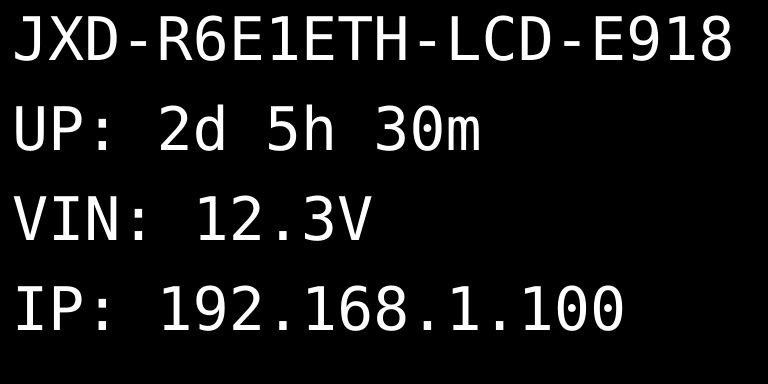
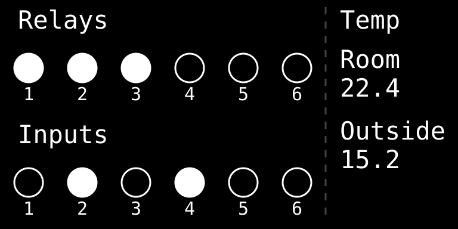

# ESPHome Device Configurations made by JetHome


This repository contains ESPHome configurations for various automation devices, including custom components for enhanced functionality. These are **open-source firmware configurations** that you can customize and build yourself.

## Supported Devices

### JXD-R6-E1ETH-LCD
JetHome DIN-rail automation controller with display. For a proprietary firmware version with additional features and support, visit [JetHome official website](https://jethome.com/).

**Configurations**:
- `JXD/jxd-r6-e1eth-lcd-eth.yaml` - Ethernet variant
- `JXD/jxd-r6-e1eth-lcd-wifi.yaml` - WiFi variant

## JXD-R6-E1ETH-LCD Features

The JXD-R6-E1ETH-LCD is a powerful DIN-rail automation controller with the following capabilities:

### Hardware
- **ESP32** microcontroller with 8MB flash and PSRAM
- **6 Relay outputs** via PCA9554 I/O expander
- **6 Digital inputs** via PCA9554 I/O expander
- **OLED Display**: SSD1306/SH1106 128x64 pixels with interactive menu
- **RTC**: PCF8563 hardware real-time clock with battery backup
- **Temperature monitoring**: Onboard TMP102 sensor + Dallas DS18B20 OneWire support
- **Connectivity**: LAN8720 Ethernet or WiFi (ESP32 built-in)
- **Voltage monitoring**: Input voltage measurement
- **RS485/Modbus**: 2x UART interfaces for Modbus RTU communication

### Software Features

- **RTC Time Synchronization**: Hardware RTC with NTP sync and battery backup
- **Modbus RTU Server**: Acts as Modbus slave with automatic group-based configuration (coils, discrete inputs, holding registers)
- **Home Assistant Integration**: Native ESPHome API with automatic entity discovery and OTA updates
- **Display Control**: Interactive OLED menu with status, time, relay control, inputs monitoring, and settings
- **Dallas Temperature Sensors**: OneWire support for multiple DS18B20 sensors ([setup guide](doc/ONEWIRE_WORKFLOW.md))

## Quick Start

### Requirements

- **Python 3.11 or higher**
- **ESPHome 2026.8.2** (pinned version for compatibility)
- USB cable or serial adapter for initial flashing
- Network connection for OTA updates

### Installation

1. **Clone this repository**:
```bash
git clone <repository-url>
cd esphome-device-configs
```

2. **Set up Python environment**:

**Linux/macOS**:
```bash
./scripts/setup.sh
source .venv/bin/activate
```

**Windows**:
```cmd
scripts\setup.bat
.venv\Scripts\activate
```

### Configuration Variants

The repository provides two configuration variants:

#### Ethernet Version
```bash
esphome run JXD/jxd-r6-e1eth-lcd-eth.yaml
```
- Uses LAN8720 Ethernet controller
- Static or DHCP IP configuration
- Best for industrial/stable installations

#### WiFi Version
```bash
esphome run JXD/jxd-r6-e1eth-lcd-wifi.yaml
```
- Uses ESP32 built-in WiFi
- Captive portal for easy setup
- WiFi credentials stored in device
- Access Point mode for configuration

### Timezone

The device gets its timezone from Home Assistant and keeps it across reboots, so local
time stays correct even when it boots without HA.

Until HA is reachable the firmware uses a compiled-in timezone. By default that is the
timezone of the machine doing the build — pin it explicitly for reproducible builds:

```bash
esphome -s timezone UTC run JXD/jxd-r6-e1eth-lcd-eth.yaml
```

or per device in `JXD/*.yaml`:

```yaml
substitutions:
  timezone: Europe/Berlin
```

Both IANA names (`Europe/Berlin`) and POSIX TZ strings (`CET-1CEST,M3.5.0,M10.5.0/3`)
are accepted. POSIX strings per zone: [posix_tz_db](https://github.com/nayarsystems/posix_tz_db/blob/master/zones.csv).

### First Flash

For the first flash, connect via USB:
```bash
esphome run JXD/jxd-r6-e1eth-lcd-eth.yaml
# or
esphome run JXD/jxd-r6-e1eth-lcd-wifi.yaml
```

Subsequent updates can be done over-the-air (OTA):
```bash
esphome run JXD/jxd-r6-e1eth-lcd-eth.yaml --device <IP_ADDRESS>
```

### WiFi Setup (WiFi Version Only)

The WiFi version supports easy configuration through a captive portal:

#### Initial Setup

1. **Flash the firmware** via USB using the WiFi configuration
2. **Device creates Access Point**:
   - SSID: `JXD-R6-E1ETH-LCD-XXXX` (where XXXX is last 2 bytes of MAC address)
   - Password: Last 4 bytes of MAC address (8 hex digits)
   - Example: If MAC is `AA:BB:CC:DD:EE:FF`, SSID will be `JXD-R6-E1ETH-LCD-EEFF` with password `ccddeeff`

3. **Connect to the AP**:
   - Use your phone or laptop to connect to the device's WiFi network
   - You can view the MAC address in the device display menu: **Menu → Info → MAC**
   
4. **Configure WiFi**:
   - Your device will show a captive portal notification suggesting to open WiFi settings
   - Tap the notification or manually navigate to `http://192.168.4.1`
   - The captive portal will display a list of available WiFi networks
   - Select your WiFi network from the list
   - Enter your WiFi password
   - Click "Save"

5. **Device connects**:
   - Device will disconnect from AP mode
   - Connects to your WiFi network
   - IP address displayed on device screen
   - Device now accessible via Home Assistant and web interface

#### Changing WiFi Settings

You can change WiFi configuration in two ways:

**Method 1: Via Display Menu (WiFi version)**
1. Press the Menu button to open the display menu
2. Navigate to: **Settings → Reset WiFi creds → Yes**
3. Device clears stored WiFi credentials and reboots in AP mode
4. Reconfigure WiFi using the captive portal (see Initial Setup above)

**Method 2: Via Configuration File**
1. Edit `include/wifi.yaml` to set default credentials
2. Recompile and upload firmware:
```bash
esphome run JXD/jxd-r6-e1eth-lcd-wifi.yaml --device <IP_ADDRESS>
```

**Method 3: Factory Reset**
1. Open display menu: **Settings → Factory reset → Yes**
2. This clears all stored data including WiFi credentials
3. Device reboots and creates AP for reconfiguration

#### WiFi AP Details

The Access Point is automatically created using device MAC address:
- **SSID Format**: `${friendly_name}-${MAC_SUFFIX}`
- **Password Format**: Last 4 MAC bytes (8 hex characters)
- **Timeout**: AP activates if no WiFi connection after 5 seconds
- **IP Address**: Device accessible at `192.168.4.1` when in AP mode

## Display UI Overview

The device features an interactive OLED display with multiple pages accessible via the menu button:

### Main Page


Shows device name, uptime, input voltage, and IP address.

### Status Page


Shows system status and diagnostic information.

### Time Page


Displays current date and time from the hardware RTC.

### Relays Control Page


View and control relay states directly from the display.

### Digital Inputs Page


Monitor the status of all 6 digital inputs in real-time.

### Menu Navigation


Interactive menu for accessing temperatures, device info, and settings including:
- Temperature sensors display
- Network information (IP, MAC address)
- Display settings (auto-off timer)
- UART settings (baudrate configuration for RS485 interfaces)
- Modbus settings (server address configuration)
- WiFi configuration (WiFi version only - Reset WiFi credentials)
- Factory reset
- Device reboot

## Documentation

- **[OneWire Workflow Guide](doc/ONEWIRE_WORKFLOW.md)**: Step-by-step guide for adding Dallas DS18B20 temperature sensors
- **[Components Documentation](doc/COMPONENTS.md)**: Details about custom and modified ESPHome components used in this project

## Custom Components

This project includes several custom and modified ESPHome components:

1. **groups**: Entity grouping system for organizing relays, inputs, and sensors
2. **modbus_server_group**: Automatic Modbus server configuration from entity groups
3. **display_menu_base**: Enhanced menu system with additional navigation options
4. **graphical_display_menu**: OLED menu renderer with value display support
5. **modbus_controller**: Enhanced with server mode, coils, and discrete inputs support

See [Components Documentation](doc/COMPONENTS.md) for detailed information.

## Modbus RTU Server

The device can act as a Modbus RTU server (slave) for integration with PLCs, SCADA systems, and other industrial automation equipment:

- **Slave Address**: Configurable via display menu (Settings → Modbus) or Home Assistant
  - Range: 1-247 (0x01-0xF7)
  - Default: 1 (0x01)
  - **Changes take effect immediately** - no reboot required
- **Baud Rate**: Configurable via display menu (Settings → UART) or Home Assistant
  - Supported rates: 1200, 2400, 4800, 9600, 19200, 38400, 57600, 115200 baud
  - Default: 9600 baud
  - Stored in flash memory (persists across reboots)
  - **Changes take effect immediately** - no reboot required
- **Coils** (0xA000+): Read/write relay states
- **Discrete Inputs** (0xA000+): Read digital input states
- **Holding Registers**: Device information and configuration

**RS-485 Connector (JXM2)**:
- Pin 1: B
- Pin 2: A
- Pin 3: B
- Pin 4: A

Configuration example in `include/jxd-jxm-modbus-auto.yaml` uses the automatic group-based mapping for simple setup.

For detailed information about the automatic Modbus server configuration, see the [modbus_server_group component documentation](components/modbus_server_group/README.md).

## Contributing

Contributions are welcome! Please feel free to submit issues or pull requests.

## License

This project is open-source.

## Related Links

- [ESPHome Official Documentation](https://esphome.io/)
- [JetHome Official Website](https://jethome.com/) - Proprietary firmware version with additional features
- [JetHome AliExpress Store](https://aliexpress.ru/store/1105052969)

## Support

For issues related to:
- **Open-source firmware**: Use GitHub issues in this repository
- **Hardware or proprietary firmware**: Contact [JetHome support](mailto:sales@jethome.com)

